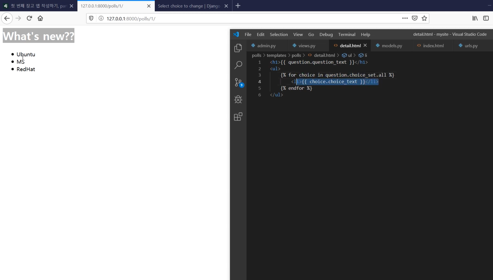

# Django Tutorial2 - Polls by Django

## Description

- Follow the django tutorial - Polls by Django

- Link : https://docs.djangoproject.com/ko/3.2/intro/

  


## Environment

- OS : Windows
- IDE : pycharm
- Version : Python 3.6.1


## Prerequisite

- Make a virtual environment

  ```shell
  $ cd polls_by_django
  $ python3 -m venv myvenv
  ```
  
- Run virtual environment

  ```shell
  C:\Users\Name\polls_by_django> myvenv\Scripts\activate
  ```

- Install Django

  - pip upgrade

    ```shell
    (myvenv) ~$ python3 -m pip install --upgrade pip
    ```

  - install Django

    ```shell
    (myvenv) ~$ pip install django~=2.0.0
    ```


## Usage

```shell
(myvenv) ~/polls_by_django$ python manage.py runserver
```

